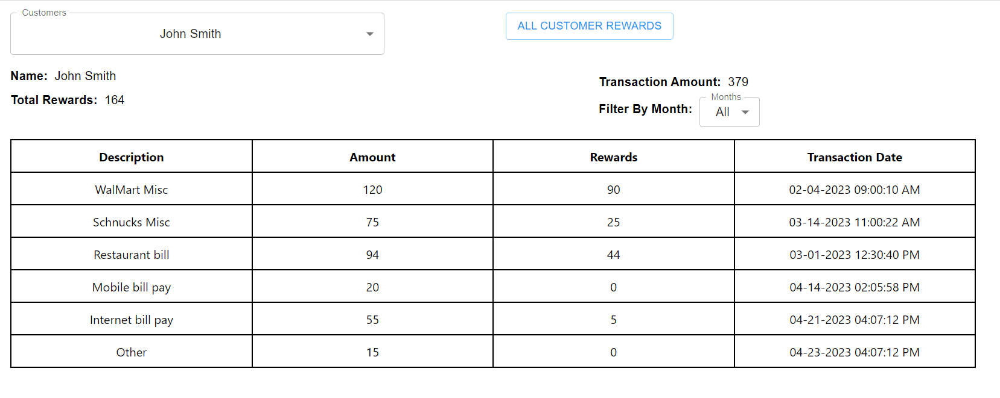
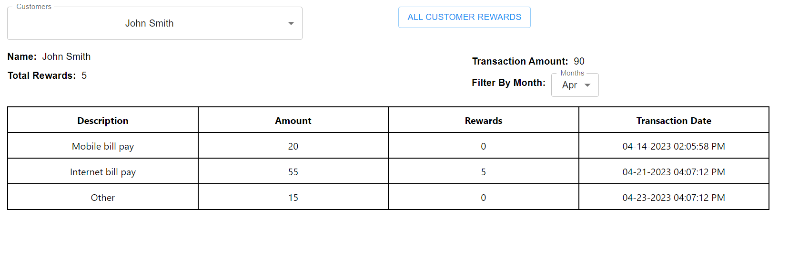
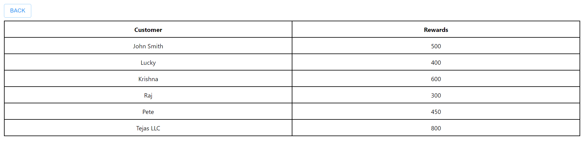

# RewardsApp-ReactJS-SpringBoot

This project consists of two applications:
1. RewardsBackend - RestAPI based on Spring Boot
2. rewards-ui - UI App based on ReactJS

# Applications

### How to start the application
Option 1:\
a. Copy the RewardsBackend-1.0.jar available under RewardsApp-ReactJS-SpringBoot to your local\
b. Run `java -jar RewardsBackend-1.0.jar`

Option 2:\
a. Open a new terminal and navigate to RewardsApp-ReactJS-SpringBoot folder (cd RewardsApp-ReactJS-SpringBoot)\
b. Run `mvn clean package`\
c. Navigate to RewardsBackend target folder \
(e.g.: cd .\RewardsApp-ReactJS-SpringBoot\RewardsBackend\target)\
d. Run `java -jar RewardsBackend-1.0.jar`

## Project Description

On load of home page list of Customers is displayed in Customers dropdown. By default the first customer is selected.

By selecting a customer in the drop down we can view the details such as 
Transaction amount for the last three months and the reward points earned. Also we have the 'Months' dropdown listed with the last three months.
By default we are displaying all the transactions for the selected customer in the tabular format.
Once we select the month transactions are filtered based on month.

Also we have 'All Customer Rewards' button which navigates us to rewards page where all the customers and their rewards are displayed.

## Technologies, Libraries and Frameworks
* React JS
* ES6, TypeScript
* Material UI
* Cypress
* Java 8
* Spring Boot
* Lombok
* Mockito
* h2 database (In-memory DB)

## Unit Testing/Integration Testing
We used `Cypress` a JavaScript-based end-to-end testing tool 

1. To run the cypress tests without seeing in the browser `npm run test:cypress`
2. To run the tests in the browser `npm run test:cypressopen`

Also, added Unit test cases for Rewardsbackend application using Mockito 
